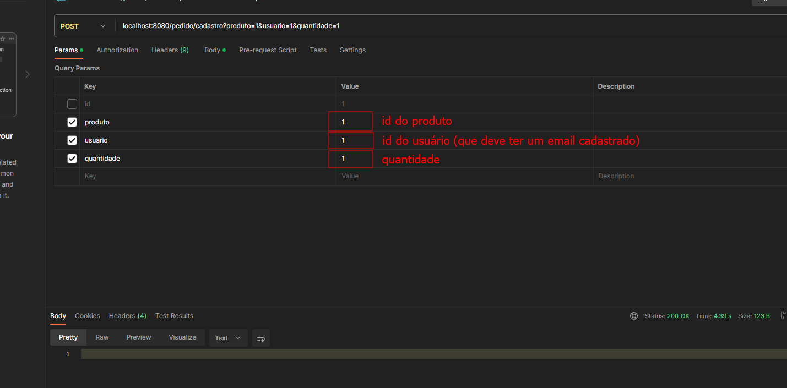

# Projeto Final - 4 Semestre (Lucas e Gustavo)

- Fala Jaymeira! Aqui tem um guia do que tu precisa fazer para rodar o projeto localmente no teu not.

## 1 - Configurar application.properties
>Dentro da pasta raiz do projeto (main.java.resources), existe um arquivo denominado application.properties, é necessário configurar um banco local para teste. 

    org.springframework.orm.jpa.vendor.Database=postgres 
    spring.datasource.plataform=postgres 
    spring.datasource.url=jdbc:postgresql://localhost:????/SEUBANCO 
    spring.datasource.username=SEUUSUARIO 
    #spring.datasource.password=SUASENHA 
    spring.jpa.show-sql=true 
    spring.jpa.generate-ddl=true 
    spring.jpa.hibernate.ddl-auto=create 
    spring.jpa.properties.hibernate.lob.non_contextual_creation=true 

    spring.mail.host=smtp.gmail.com 
    spring.mail.port=587 
    spring.mail.username=luucaasm11@gmail.com 
    spring.mail.password=tcuyhwcfcezbkikl 
    spring.mail.properties.mail.smtp.outh=true 
    spring.mail.properties.mail.smtp.starttls.enable=true 

## 2 - Rodar o projeto

>Após isso, você já pode rodar o projeto no Debug!

## 3 - Mapeamento dos Endpoints

- Endereço
>CRIAR ENDEREÇO - /endereco/cadastro  
LISTAR ENDEREÇO - /endereco/lista  
> EXCLUIR ENDEREÇO - /endereco/excluir/{id}

- Forma de Pagamento
>CRIAR FORMA DE PAGAMENTO - /formaPagamento/cadastro  
LISTAR FORMAS DE PAGAMENTO - /formaPagamento/lista  
> EXCLUIR FORMAS DE PAGAMENTO - /formaPagamento/excluir/{id}

- Pedido
>CRIAR PEDIDO - /pedido/cadastro  
LISTAR PEDIDOS - /pedido/lista  
EXCLUIR PEDIDO - /pedido/excluir/{id}

- Produto
>CRIAR PRODUTO - /produto/cadastro  
LISTAR PRODUTOS - /produto/lista  
EXCLUIR PRODUTOS - /produto/excluir/{id}

- Usuário
>CRIAR USUÁRIO - /usuario/cadastro  
LISTAR USUÁRIOS - /usuario/lista  
EXCLUIR USUÁRIO - /usuario/deletarUsuario/{id}

## 4 - Massa de dados para teste do pedido

>Para testar o endpoint de criação de PEDIDO, é 
> necessário criar uma massa de dados no seu BD. Outra <b>observação</b> é que se 
> você quiser receber o pedido no seu GMAIL, é necessário criar um novo usuário com 
> o modelo do INSERT abaixo.

    INSERT INTO usuario (cpf, email, nome)
    VALUES ('123.456.789-00', 'luucaasm11@gmail.com', 'Lucas')
    
    INSERT INTO usuario (cpf, email, nome)
    VALUES ('222.222.222-22', 'limamachadogustavo@gmail.com', 'Gustavo')

    INSERT INTO produto (nome)
    VALUES ('Coca Cola')
    
    INSERT INTO produto (nome)
    VALUES ('X Salada')

## - Criando pedidos

> 

